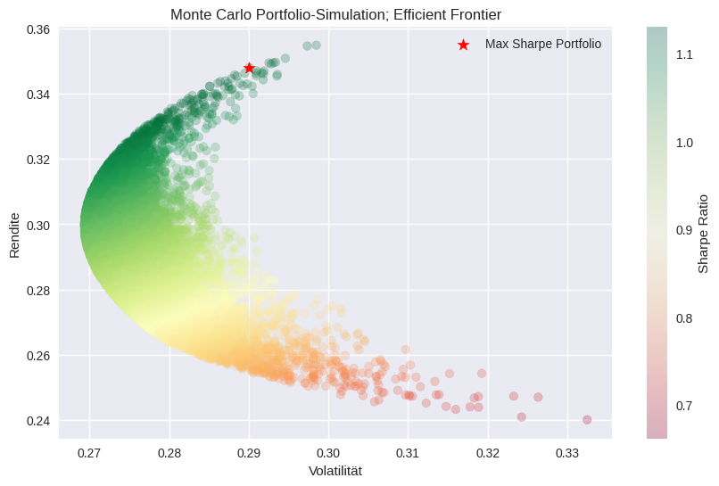
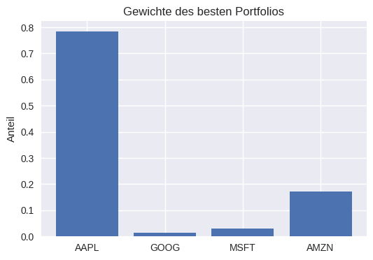

# 📊 Portfolio-Optimierung nach dem Markowitz-Modell
Dieses Projekt implementiert die Portfolio-Optimierung nach **Markowitz** mit Hilfe einer **Monte-Carlo-Simulation**.

## Libraries
- yfinance
- pandas
- numpy
- matplotlib
- seaborn

## Features
- Berechnung **annualisierter Renditen**, **Valatilität**, **Sharpe Ratio**
- **Monte-Carlo-Simulation** von tausenden Portfolios
- Visualisierung der **Efficient Frontier**
- Identifikation des Portfolios mit der maximalen Sharpe Ratio
- Dart#stellung der oprimalen Portfoliogewichte

## Nutzung

**Option 1:** [In Google Colab öffnen](https://colab.research.google.com/drive/1JZ5d3pe-WvqEwcd8hncb7VQAIKlQT3uU?usp=sharing)

(einfach im Browser ausführen, keine Installation notwendig)

**Option 2:** Lokal ausführen
1. Repo klonen
  ```bash
  git clone https://github.com/jantschpk/portfolio-optimization.git
  cd portfolio-optimization
```

2. Libraries installieren
   ```bash
   pip install -r requirements.txt

3. Notebook starten
   ````bash
   jupyter notebook portfolio_montecarlo.ipynb

## Beispiel-Plots




## Hintergrund: Markowitz Portfolio Theory

Die **Modern Portfolio Theory (MPT)** wurde von Harry Markowitz (1952) entwickelt.

### Grundidee
Jedes Portfolio hat zwei grundlegende Kennzahlen:
- Erwartete Rendite
- Volatilität
  
### Efficient Frontier
- Die **Efficient Frontier** ist die Menge aller Portfolios, die als "effizient" gelten, da keine andere Kombination von Vermögenswerten eine höhere Rendite bei gleichem Risiko oder ein geringeres Risiko bei gleicher Rendite bieten kann.
- Das **optimale Portfolio** ist jenes mit der höchsten **Sharpe Ratio** (Verhältnis von Überschussrendite zu Volatilität)

   
 
